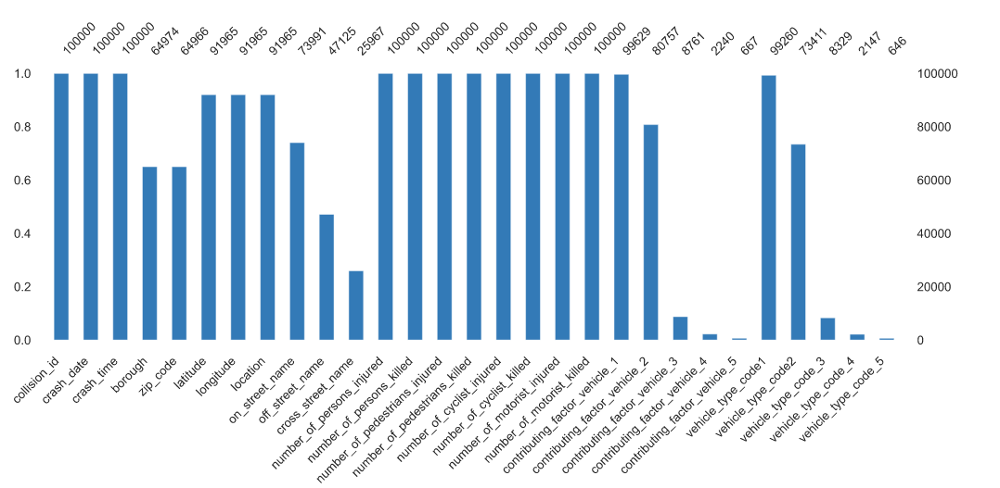

# Data preprocessing - NYC Motor Vehicle Crashes

#### BeCode challenge: from 08/12/20 to 11/12/20

#### Contributors: Guillaume

## Aim of this project

The goal of this project is to clean a [dataset](https://data.cityofnewyork.us/Public-Safety/Motor-Vehicle-Collisions-Crashes/h9gi-nx95 "Title"), which represents crashes that occured in New York City, in order to run machine learning algorihtms. This task requires a certain number of steps that will be exposed and explained below.
The end result should not contain any missing values, no dupplicates and data formats should be correct. Moreover, the dataset should be optimized in order to, on the one hand, be statistically correct and, on the other hand, be as informative as possible.

## Repository content

- The raw data as well as the cleaned data for 100,000 and 1,000,000 rows.
- Two jupyter notebooks for the 100,000 and the 1,000,000 rows datasets that contain the steps performed to reach the cleaned dataset mentionned above.
- Two profile reports created thanks to [pandas_profiling](https://pandas-profiling.github.io/pandas-profiling/docs/master/rtd/ "Title").

## Libraries used in Python

- [Pandas](https://pandas.pydata.org/ "Title")
- [Pandas_profiling](https://pandas-profiling.github.io/pandas-profiling/docs/master/rtd/ "Title")

## Steps 

In order to simplify our approach, we will only present the 100,000 rows dataset. 

  
 Handling missing values 

The following graph shows the number of missing values of our initial dataset. 

 

As one can notice, some of the columns are massively empty (more than 40% of missing values). We can cite: 
- *cross_street_name*, 
- *off_street_name*, 
- *contributing_factor_vehicle_3*, 
- *contributing_factor_vehicle_4*, 
- *contributing_factor_vehicle_5*, 
- *vehicle_type_code_3*, 
- *vehicle_type_code_4*, 
- *vehicle_type_code_5*. 

Therefore, we decided to simply remove these columns as it becomes almost impossible to fill them with values without biaising our analysis. 
This ends up with two main contributing factors and 2 vehicle types in the accident. 

The work here is not over as we still need to deal with columns that have missing values. 

- Firstly, we noticed that sometimes, police officer insert contributing factors and vehicle types in one column and separate them with "/", i.e. *Station Wagon/Sport Utility Vehicle*. Therefore, we decided to split the two elements and store them nicely in the corresponding columns. All the remaining missing values were assigned the value "Unspecified". 

- Secondly, we decided to remove all the rows without location and with a null location because those crashes were simply impossible to locate and thus were not very interesting. As it only represents 8% of the total number of rows, the dataset still contains 91,797 rows. 

- Thirdly, *borough* and *zip_codes* are two columns with high percentage of missing values (~35%). As far as borough are involved, we decided to take the min-max of the latitude and longitude for all different boroughs and assign one based on if the latitude **AND** longitude of a given crash are in this interval min-max. Even if we are aware that boroughs are not perfect rectangles and this approach may assign wrong values, we believe that the majority of missing values are correctly classified. For the remaining empty cells of *borough* and *zip_codes* , we decided to sort the location and assign the value of the row above (using [the ffil method of fillna](https://pandas.pydata.org/pandas-docs/stable/reference/api/pandas.DataFrame.fillna.html "Title")). The rest of missing values were given the value of *"Unspecified"*.

- Finally, for *on_street_name*, we applied the same [the ffil method of fillna](https://pandas.pydata.org/pandas-docs/stable/reference/api/pandas.DataFrame.fillna.html "Title") and *"Unspecified"* for the remaining empty values.

  
 Consolidate data 

The vehicle types columns contain many different values that often refer to the same concept. Abbreviations, capitalization or misspellings make it more difficult for us. Therefore, we decided to consolidate some of the most frequent values as one can see in the following tab:

|             | To change values                                                                                                                                                                |
|-------------|---------------------------------------------------------------------------------------------------------------------------------------------------------------------------------|
| Ambulance   | "AMB", 'AMBUL', "Ambul", 'AMBU', 'ambul',  'AMBULANCE', 'AMBULACE', 'GEN  AMBUL', 'AMBULENCE', 'FDNY AMBUL', 'Fdny ambul', 'White ambu', 'NYC AMBULA',  'AMBULENCE', 'abulance' |
| Sedan       | "2 dr sedan", '4 dr sedan'                                                                                                                                                      |
| Van         | "van", 'Armored Truck', "VAN", 'Refrigerated Van'                                                                                                                               |
| Taxi        | "TAXI"                                                                                                                                                                          |
| Bus         | 'School Bus', 'bus'                                                                                                                                                             |
| Unspecified | 'UNKNO', 'Unkno', 'UNKNOWN', 'Unknown'                                                                                                                                          |
| Truck       | "TRUCK"                                                                                                                                                                         |

Note that the table is slightly different for the 1,000,000 file.
Moreover, in order to facilitate the different categories of vehicules, we replace all the values of types *vehicle_type_code_1*, *vehicle_type_code_2*, for that occur less than 1010 times by *"other"*.

  
 Consolidate data 

